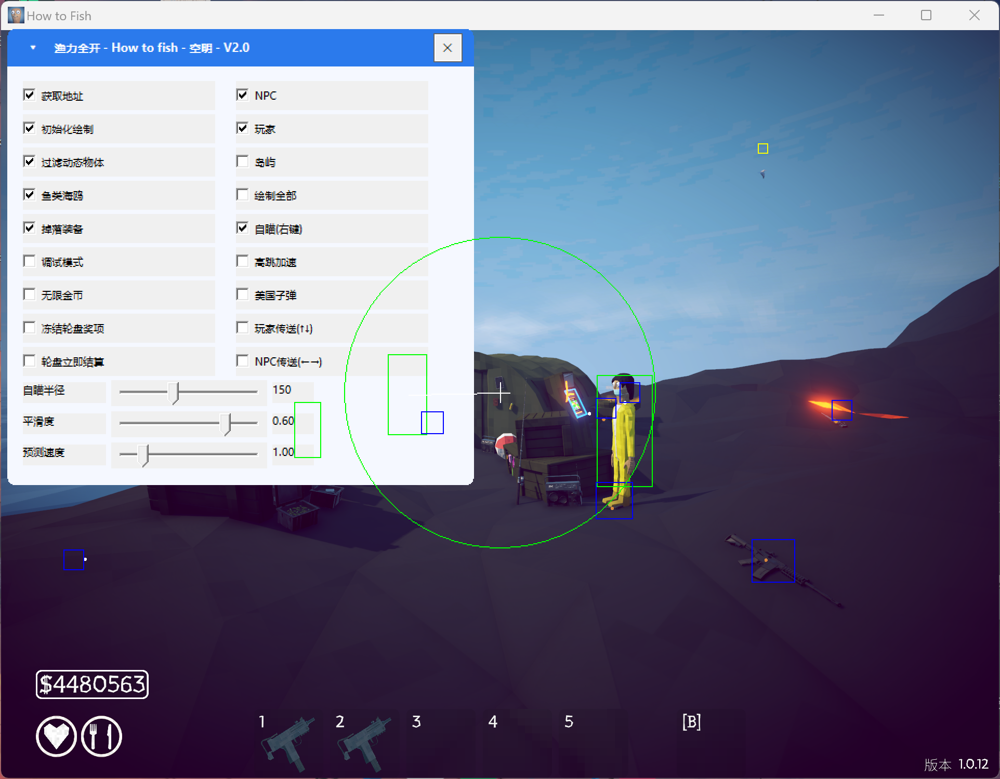

# kongming-How to Fish-tool
空明渔力全开（How to Fish）外部辅助 - 纯 C++ / Win32 API，支持绘制、自瞄、传送、轮盘、秒杀等功能，仅供学习研究。
# 🎣 空明渔力全开 - How to Fish 辅助工具
> 纯 C++ 外部辅助，无需注入，安全稳定。
> 适配2026/9/5-1.0.12补丁
## ✨ 功能
- 🎯 实体绘制（NPC、玩家、鱼类、海鸥、岛屿）
- 🖱️ 自瞄（右键触发，可调半径/平滑度/预测速度）
- 🚀 玩家/NPC 传送（方向键切换目标）
- 🎰 轮盘冻结 & 立即结算
- 💰 无限金币、高跳加速、美国子弹（100倍开火子弹秒杀）

## 📸 效果预览

## ⚙️ 快速开始
1. 启动游戏，进入场景
2. 以管理员身份运行辅助程序
3. 点击"获取地址" → "初始化绘制"
4. 按需开启功能
